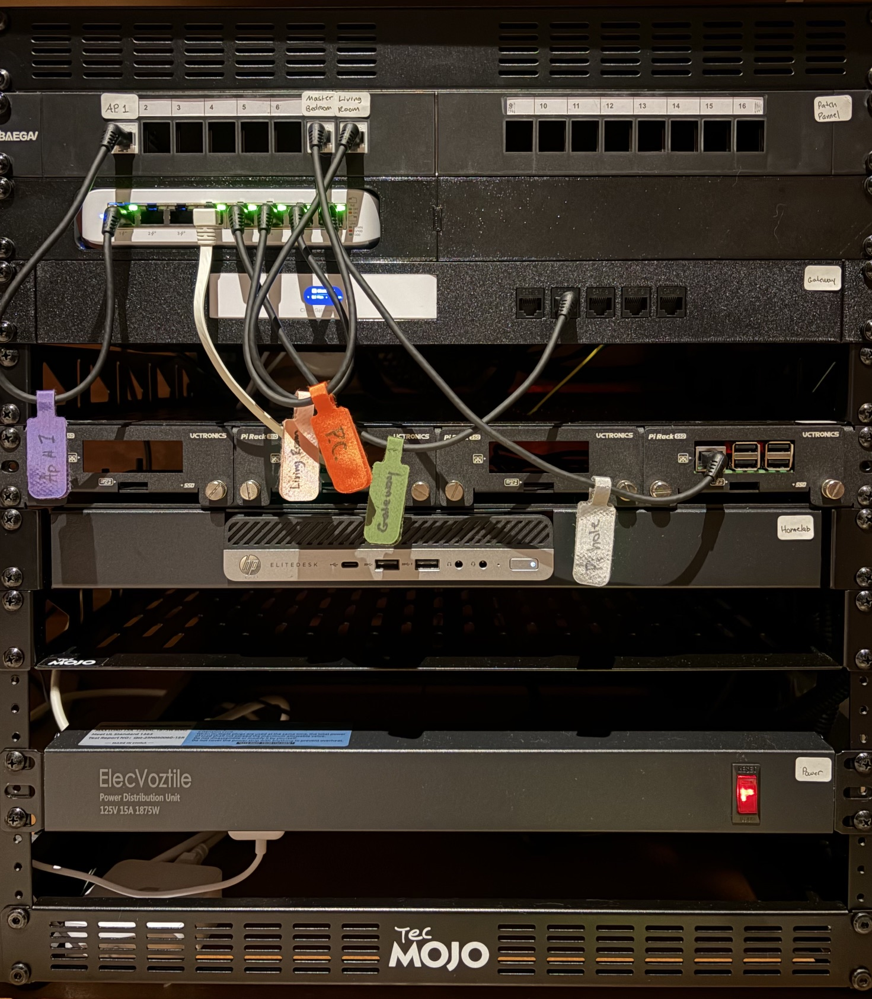
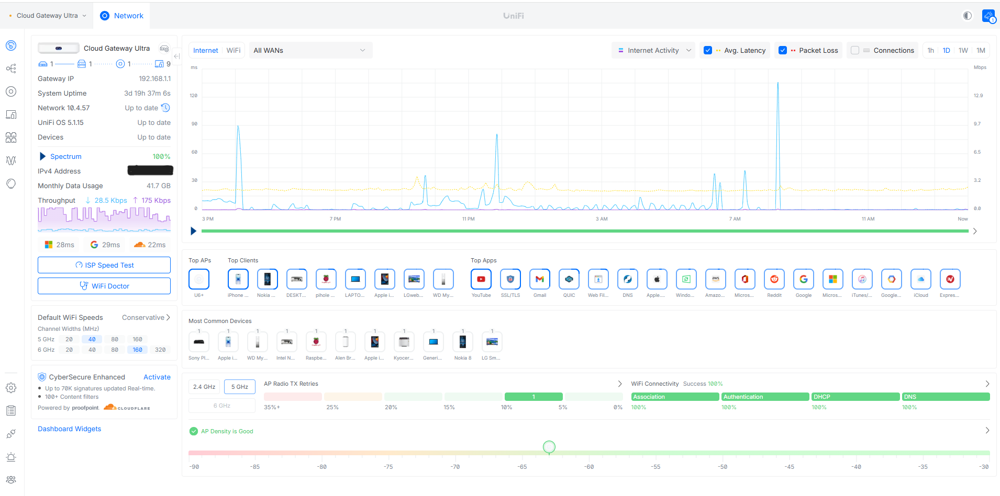
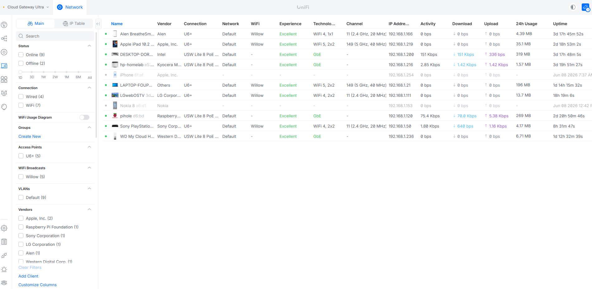

# Homelab Network Infrastructure


A working homelab network built with UniFi, Ubuntu Server, Docker, Pi-hole, Unbound, Portainer, and Uptime Kuma.

This project demonstrates hands-on experience with network infrastructure, Linux administration, DNS, containers, monitoring, structured cabling, security planning, and technical documentation.

---

## Project Highlights

* Built and organized a 12U network rack
* Installed structured Cat6 cabling and a patch panel
* Configured a UniFi gateway, managed PoE switch, and wireless access point
* Deployed Pi-hole with Unbound for network-wide DNS filtering and recursive resolution
* Installed Ubuntu Server and Docker on an HP mini PC
* Deployed Portainer and Uptime Kuma
* Validated DHCP, DNS, filtering, SSH, and container availability
* Designed future VLAN segmentation and firewall policies

---

## Current Status

* [x] Rack and structured cabling installed
* [x] UniFi network deployed
* [x] Pi-hole and Unbound configured
* [x] Ubuntu Docker host deployed
* [x] Portainer and Uptime Kuma running
* [x] Core services tested and documented
* [ ] Guest, IoT, Lab, and Management VLANs
* [ ] Inter-VLAN firewall rules
* [ ] VPN remote access
* [ ] UPS and temperature monitoring

---

## Network Architecture

```text
Internet
   |
Netgear Cable Modem
   |
UniFi Cloud Gateway Ultra
Router / Firewall / DHCP
   |
UniFi USW Lite 8 PoE Switch
   |
   +-- UniFi U6+ Access Point
   +-- Patch Panel and Room Drops
   +-- Raspberry Pi
   |     +-- Pi-hole
   |     +-- Unbound
   |
   +-- HP Mini PC
   |     +-- Ubuntu Server
   |     +-- Docker
   |     +-- Portainer
   |     +-- Uptime Kuma
   |
   +-- WD My Cloud Storage
```

### DNS Flow

```text
Client Device
      |
Pi-hole
192.168.1.120
      |
Unbound
127.0.0.1:5335
      |
Authoritative DNS Servers
```

---

## Visual Overview

### Physical Rack

<p align="center">
  
</p>

### UniFi Dashboard

<p align="center">
  
</p>

### Connected Clients

<p align="center">
  
</p>

---

## Hardware and Services

| Component                 | Purpose                                        |
| ------------------------- | ---------------------------------------------- |
| UniFi Cloud Gateway Ultra | Router, firewall, DHCP, and network management |
| UniFi USW Lite 8 PoE      | Managed switching and PoE                      |
| UniFi U6+                 | Wireless access                                |
| Raspberry Pi              | Pi-hole and Unbound                            |
| HP Mini PC                | Ubuntu Server and Docker host                  |
| Portainer                 | Container management                           |
| Uptime Kuma               | Service and host monitoring                    |
| WD My Cloud               | Network storage                                |
| 24-Port Patch Panel       | Structured Ethernet termination                |
| 12U Rack and PDU          | Equipment organization and power               |

---

## Network Configuration

| Setting     | Value                        |
| ----------- | ---------------------------- |
| Gateway     | `192.168.1.1`                |
| Subnet      | `192.168.1.0/24`             |
| DHCP Server | UniFi Gateway                |
| DNS Server  | `192.168.1.120`              |
| Pi-hole     | `192.168.1.120`              |
| Unbound     | `127.0.0.1:5335`             |
| Docker Host | `192.168.1.216`              |
| Portainer   | `https://192.168.1.216:9443` |
| Uptime Kuma | `http://192.168.1.216:3001`  |

DHCP remains on the UniFi gateway, while Pi-hole handles client DNS. Pi-hole forwards approved requests to Unbound for recursive resolution.

---

## Validation

The environment was tested with DHCP inspection, DNS lookups, recursive resolution checks, SSH, Docker status, and application monitoring.

### Client DHCP and DNS

```powershell
ipconfig /all
```

Confirmed:

```text
Default Gateway: 192.168.1.1
DHCP Server:     192.168.1.1
DNS Server:      192.168.1.120
```

### Pi-hole

```powershell
nslookup google.com
```

Confirmed that requests were sent to:

```text
Server:  pi.hole
Address: 192.168.1.120
```

### DNS Filtering

```powershell
nslookup doubleclick.net
```

Confirmed blocked response:

```text
0.0.0.0
```

### Unbound

```bash
dig google.com @127.0.0.1 -p 5335
```

Confirmed:

```text
status: NOERROR
```

### Docker

```bash
docker ps
```

Confirmed running containers:

```text
portainer
uptime-kuma
```

---

## Security Decisions

* Administrative services are internal only
* No direct public exposure of SSH, Pi-hole, Portainer, or Uptime Kuma
* DHCP is centralized on the UniFi gateway
* Pi-hole DHCP is disabled to prevent conflicts
* Sensitive information is removed from screenshots and configurations
* Future remote access will use a VPN instead of public port forwarding
* Guest and IoT devices will be isolated using VLANs and firewall rules

---

## Planned VLAN Design

| Network         | Example Subnet    | Purpose                           |
| --------------- | ----------------- | --------------------------------- |
| Main LAN        | `192.168.1.0/24`  | Trusted devices and core services |
| IoT VLAN        | `192.168.20.0/24` | Smart and consumer devices        |
| Guest VLAN      | `192.168.30.0/24` | Internet-only guest access        |
| Lab VLAN        | `192.168.40.0/24` | Docker, testing, and SDN labs     |
| Management VLAN | `192.168.99.0/24` | Infrastructure administration     |

---

## Skills Demonstrated

* Network rack planning and installation
* Structured Ethernet cabling
* UniFi network administration
* DHCP and DNS configuration
* Pi-hole and Unbound
* Ubuntu Server administration
* Docker and Portainer
* Infrastructure monitoring
* Network troubleshooting
* VLAN and firewall planning
* Security documentation
* Technical validation and reporting

---

## Repository Structure

```text
homelab-network-infrastructure/
├── README.md
├── docs/
├── diagrams/
├── screenshots/
└── configs/
    ├── docker-compose/
    ├── pihole/
    ├── unbound/
    └── sanitized-examples/
```

---

## Future Improvements

* Deploy segmented VLANs
* Configure inter-VLAN firewall rules
* Add VPN remote access
* Add a secondary Pi-hole
* Add UPS and temperature monitoring
* Build an Open vSwitch and Mininet SDN lab

---

## Security Notice

This repository should not contain passwords, API keys, private keys, public IP addresses, recovery codes, serial numbers, or unredacted configuration backups.

Private LAN addresses such as `192.168.1.x` are included only for documentation.
