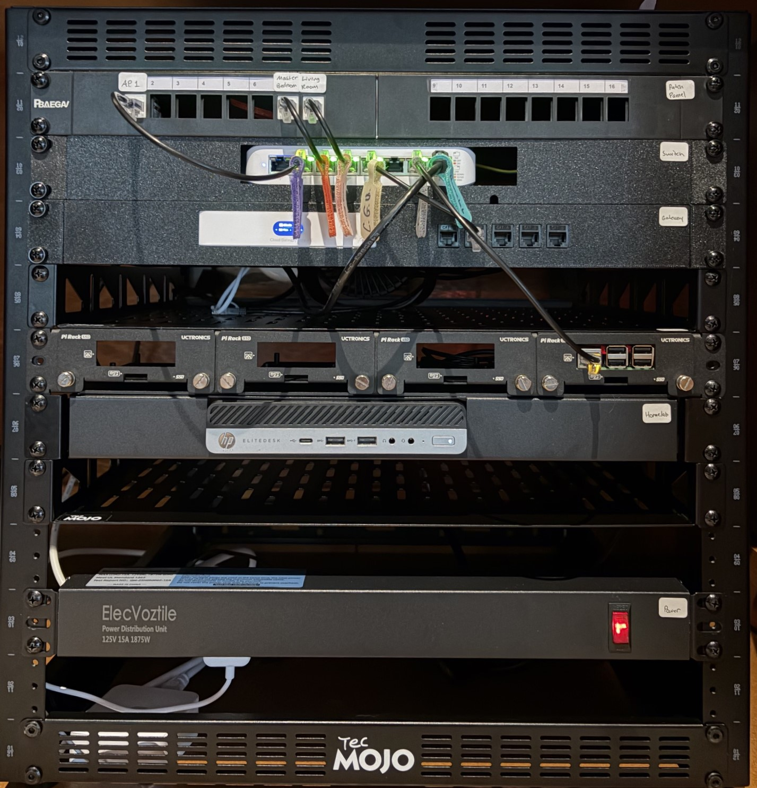

# Rack Build and Physical Network Infrastructure

## Overview

This document covers the physical network rack build for the homelab environment.

The goal of this part of the project was to centralize the home network equipment into a structured rack setup that supports routing, switching, patching, DNS services, Docker services, monitoring, and future network segmentation.

This rack is the physical foundation for the rest of the homelab.

## Goals

The goals for the rack build were:

* Build a clean and expandable 12U network rack.
* Centralize the gateway, switch, patch panel, Raspberry Pi, mini PC, and power distribution.
* Place the patch panel close to the switch for short patch cable runs.
* Keep Ethernet and power cabling organized.
* Leave space for future expansion.
* Make the rack easy to troubleshoot and document.

## Hardware Used

| Hardware                     | Purpose                                            |
| ---------------------------- | -------------------------------------------------- |
| 12U network rack             | Central rack for network equipment                 |
| AC Infinity rack fan         | Rack airflow and cooling                           |
| 24-port keystone patch panel | Termination point for Ethernet runs                |
| UniFi USW Lite 8 PoE switch  | Main managed switch                                |
| UniFi Cloud Gateway Ultra    | Router, firewall, DHCP server, gateway             |
| Raspberry Pi rack mount      | Mount for Raspberry Pi running Pi-hole and Unbound |
| HP mini PC                   | Ubuntu Docker host                                 |
| Rack PDU                     | Power distribution                                 |
| Cat6 Ethernet cabling        | Permanent network runs and patching                |

## Rack Layout

```text
Top / Roof: AC Infinity Rack Fan

U12  Blank / Airflow
U11  24-port Keystone Patch Panel
U10  UniFi Switch
U9   UniFi Gateway
U8   Raspberry Pi Rack Mount
U7   HP Mini PC Shelf
U6   Blank / Airflow
U5   Future Expansion
U4   Future Expansion
U3   Future Expansion
U2   Rack PDU / Power Strip
U1   Blank / Future UPS
```

## Rack Photo



The rack includes the patch panel, UniFi switch, UniFi gateway, Raspberry Pi rack mount, HP mini PC, and rack PDU.

The patch panel is positioned directly above the switch to keep patch cables short and easier to trace.

## Cabling Approach

Permanent Ethernet runs are terminated into the patch panel.

Short premade Cat6 patch cables are used inside the rack for connections between the patch panel, switch, gateway, Raspberry Pi, and mini PC.

Solid-core Cat6 is used for permanent attic and wall runs. Premade stranded patch cables are better inside the rack because they are more flexible and put less stress on switch ports and patch panel jacks.

## Ethernet Termination Standard

The permanent Ethernet runs use T568A termination.

```text
Patch panel side: T568A
Wall jack / endpoint side: T568A
```

Store-bought patch cables may use T568A or T568B internally as long as each patch cable is wired straight-through on both ends.

## Current Patch Panel Use

| Patch Panel Port | Destination    | Notes                          |
| ---------------: | -------------- | ------------------------------ |
|             PP01 | Access Point   | UniFi AP drop                  |
|             PP02 | Spare          | Available for future use       |
|             PP03 | Spare          | Available for future use       |
|             PP04 | Spare          | Available for future use       |
|             PP05 | Spare          | Available for future use       |
|             PP06 | Spare          | Available for future use       |
|             PP07 | Master Bedroom | Wired room drop                |
|             PP08 | Living Room    | Wired room drop                |
|        PP09-PP24 | Spare          | Available for future expansion |

## Current Rack Devices

| Device             | Role                                           |
| ------------------ | ---------------------------------------------- |
| UniFi Gateway      | Router, firewall, DHCP server, network gateway |
| UniFi Switch       | Main managed switch                            |
| Raspberry Pi       | Pi-hole and Unbound DNS server                 |
| HP Mini PC         | Ubuntu Docker host                             |
| WD My Cloud        | Network storage                                |
| UniFi Access Point | Wireless access point through patch panel      |

## Design Choices

The patch panel was placed directly above the switch so that patch cables could be short, clean, and easy to trace.

The PDU was placed lower in the rack so power cables could be routed separately from Ethernet/data cables where possible.

Blank spaces were left in the rack for airflow and future expansion.

The Raspberry Pi and mini PC were mounted below the core networking equipment because they are servers/services rather than switching or routing devices.

## Lessons Learned

* Planning the rack layout before mounting equipment makes cable management easier.
* Patch panel placement has a major effect on how clean the rack looks.
* Premade patch cables are better than stiff solid-core cable for rack patching.
* Labeling ports and documenting connections makes troubleshooting much easier.
* Leaving extra rack space is better than filling every rack unit immediately.
